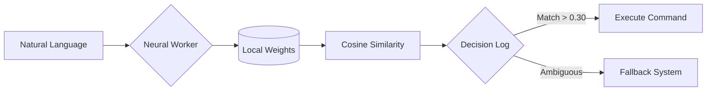

```text
      ___           ___           ___           ___           ___           ___           ___     
     /\  \         /\  \         /\  \         /\  \         /\  \         /\  \         /\  \    
    /::\  \        \:\  \       /::\  \       /::\  \       /::\  \       /::\  \       /::\  \   
   /:/\:\  \        \:\  \     /:/\:\  \     /:/\:\  \     /:/\:\  \     /:/\:\  \     /:/\:\  \  
  /::\~\:\  \       /::\  \   /::\~\:\  \   /:/  \:\  \   /:/  \:\  \   /:/  \:\  \   /:/  \:\__\ 
 /:/\:\ \:\__\     /:/\:\__\ /:/\:\ \:\__\ /:/__/ \:\__\ /:/__/ \:\__\ /:/__/ \:\__\ /:/__/ \:|__|
 \/__\:\/:/  /    /:/  \/__/ \/__\:\/:/  / \:\  \  \/__/ \:\  \  \/__/ \:\  \  \/__/ \:\  \  /|  |
      \::/  /    /:/  /           \::/  /   \:\  \        \:\  \        \:\  \        \:\  \  |  |
      /:/  /     \/__/            /:/  /     \:\  \        \:\  \        \:\  \        \:\  \ |  |
     /:/  /                      /:/  /       \:\__\        \:\__\        \:\__\        \:\__\|__|
     \/__/                       \/__/         \/__/         \/__/         \/__/         \/__/ 
                                                                                
                          // NEURAL_INTENT_ENGINE // ZERO_TRUST_INFRA //
```

# ⚡ ATROCITY.DEV

[](https://www.cloudflare.com/)
[](https://cloud.google.com/)
[](https://owasp.org/)

> **SYSTEM_STATUS:** `[OPERATIONAL]`  
> **THREAT_LEVEL:** `[ELEVATED]`  
> **CLASSIFICATION:** `[TOP_SECRET]`

Atrocity.dev is not just a portfolio. It is a **hardened agentic sandbox** built to demonstrate the convergence of **Offensive Security** and **Edge-AI**. It features a zero-open-port architecture and a custom-built neural intent engine running entirely in the client-side sandbox.

---

## 🛰 NEURAL INTENT ENGINE (V2)

The core of the Atrocity terminal is a **Self-Hosted Neural Processor** built with `Transformers.js`. 

- **Local Inference:** Runs a quantized `all-MiniLM-L6-v2` model directly in a **Web Worker**.
- **Privacy Hardened:** `connect-src 'self'` ensures 0% of your data ever leaves the browser.
- **Semantic Mapping:** Maps natural language queries to site commands with vector similarity scoring.
- **WASM Acceleration:** Secured via `wasm-unsafe-eval` for near-native inference speeds without compromising standard XSS protections.



---

## 🛡 INFRASTRUCTURE & ZERO-TRUST DEVOPS

Built on the principle of "Assume Breach," the underlying infrastructure is invisible and unreachable from the public internet.

### 🌐 The Edge
- **Cloudflare Proxying:** Full SSL/TLS encryption, WAF protection, and edge caching.
- **Regex CORS Hardening:** Dynamic origin validation for seamless local-to-prod development without sacrificing security.

### ☁️ The Core (GCP)
- **Zero-Open-Ports:** The VM has **no public IP ingress**. 
- **IAP Tunneling:** Remote administration and deployments occur strictly via **Identity-Aware Proxy (IAP)**.
- **Keyless CI/CD:** Uses **Workload Identity Federation (WIF)** to authenticate GitHub Actions to GCP. No long-lived service account keys exist in the repository.

### 📦 The Sandbox
- **Multi-Stage Docker:** Minimized attack surface using `node:25-alpine`.
- **Hardened Nginx:** Content Security Policy (CSP) designed to allow WASM while strictly forbidding standard JS `eval()` and unauthorized CDNs.

---

## 🕹 TERMINAL SANDBOX // EASTER EGGS

The terminal is a fully interactive shell with hidden functionalities for those who know where to look.

| Command | Payload |
| :--- | :--- |
| `man hire` | Displays the Ashley Thomas Roy implementation manual. |
| `hack` | Initiates a cryptographic firewall bypass minigame. |
| `breach` | Unlocks the Classified Dossier (Requires Level 5 Clearance). |
| `matrix` | Initiates a system-wide neural override. |
| `sudo rm -rf /` | **[CRITICAL]** Initiates a simulated system meltdown. |
| `nmap localhost` | Scans internal container services. |

---

## 🛠 TECH MATRIX

```text
[FRONTEND] ----------------> React 18 // TypeScript // Framer Motion // Tailwind
[AI_ENGINE] ---------------> Transformers.js v2 // ONNX Runtime // Web Workers
[BACKEND] -----------------> Node.js 25 // Express // Mongoose // Zod
[INFRA] -------------------> Docker // Nginx // Cloudflare // GCP Compute
[PIPELINE] ----------------> GitHub Actions // WIF // IAP // Docker Hub
```

---

## 🚀 INSTALLATION

```bash
# Clone the repository
git clone https://github.com/ATR-oCiTy/atrocity.dev.git

# Initialize model weights (Self-Hosted AI)
./scripts/download_models.sh

# Spin up the containers
docker compose up -d
```

---

<p align="center">
  
  <br>
  <b>Constructed by Ashley Thomas Roy</b><br>
  <i>Cybersecurity Student // AI Researcher</i><br>
  <code>// ASHLEY_TR_MEC_GMAIL_COM //</code>
</p>
