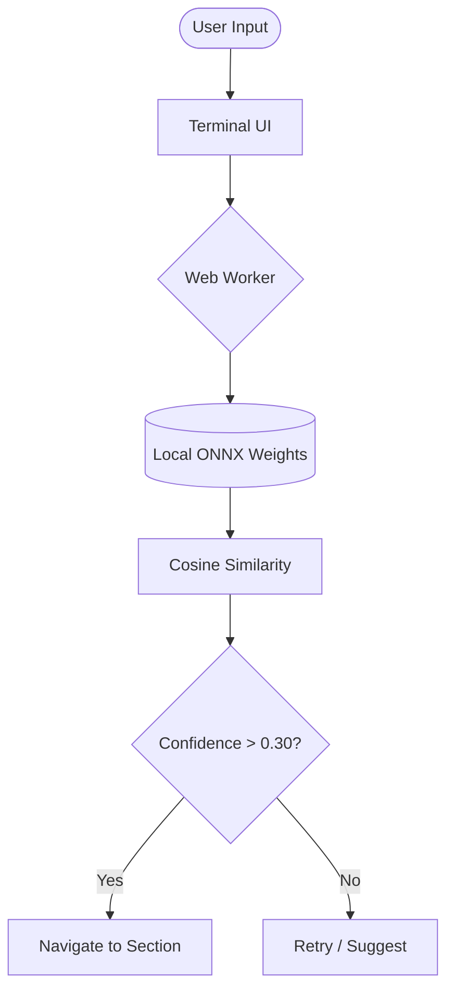

# ⚡ ATROCITY.DEV // NEURAL_SEC_ENGINE

[](https://cloud.google.com/)
[](https://huggingface.co/)
[](https://owasp.org/)

> **Status: [ACTIVE]**  
> **Classification: REDACTED**  
> **System: Agentic AI Portfolio & Cybersecurity Sandbox**

A high-performance, hardened digital dossier and terminal interface built for the intersection of Offensive Security and Agentic AI. 

---

## 🛰 NEURAL INTENT ENGINE (EDGE AI)

Unlike standard portfolios, Atrocity features a **Self-Hosted Neural Intent Engine** running directly in your browser.

- **Transformers.js (v2):** Local inference using a quantized `all-MiniLM-L6-v2` model.
- **Privacy-First:** 100% of the NLP processing happens on the client-side via Web Workers. No tracking, no external CDN dependencies.
- **Vector Mapping:** Semantic command discovery with a confidence-weighted decision logic.



---

## 🛡 SECURITY ARCHITECTURE

The infrastructure is designed with a **Red-Team Mindset**, assuming breach at the edge and protecting the core.

### Infrastructure Highlights:
- **Zero-Trust Deployment:** Workload Identity Federation (WIF) eliminates long-lived GCP keys.
- **IAP Tunneling:** Production VM has **zero open ports** to the public internet; deployment happens via Identity-Aware Proxy (IAP).
- **Hardened CSP:** Granular `wasm-unsafe-eval` policy for secure AI execution without opening traditional XSS vectors.
- **Docker Isolation:** Multi-stage builds using `node:alpine` images to minimize attack surface and patch vulnerabilities.

### Terminal Sandbox:
The terminal isn't just a UI; it's a simulated environment with:
- `hack`: A cryptographic bypass minigame.
- `ls -la`: Hidden system logs and classified dossiers.
- `sudo rm -rf /`: Don't try this unless you want to see the system melt down.

---

## 🛠 TECH STACK

| Layer | Technologies |
| :--- | :--- |
| **Frontend** | React 18, Vite, Framer Motion, TailwindCSS |
| **Edge AI** | Transformers.js, ONNX Runtime, Web Workers |
| **Backend** | Node.js, Express, TypeScript, MongoDB |
| **DevOps** | Docker, Docker Compose, GitHub Actions |
| **Cloud** | GCP (Compute Engine, IAP, Artifact Registry) |
| **Security** | Zod Validation, HSTS, Secure CSP, WIF |

---

## 🚀 LOCAL DEPLOYMENT

```bash
# Clone the repository
git clone https://github.com/ATR-oCiTy/atrocity.dev.git

# Install dependencies
npm run install:all

# Launch the neural processor
npm run dev
```

---

<p align="center">
  
  <br>
  <b>Constructed by Ashley Thomas Roy</b><br>
  <i>Cybersecurity Student // AI Researcher</i>
</p>
