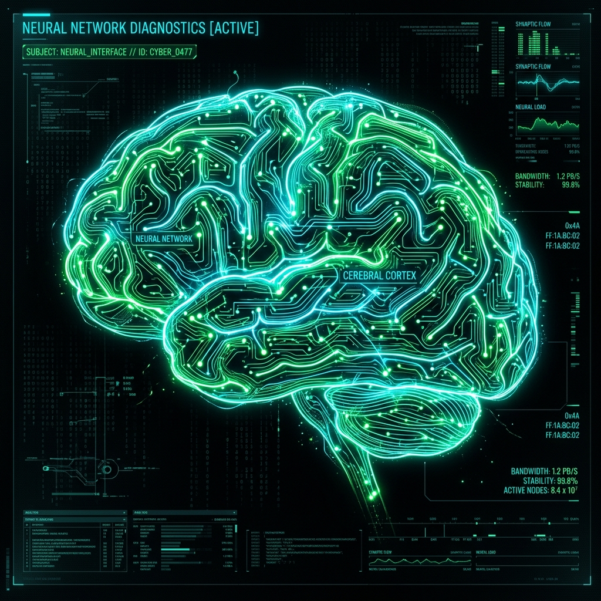
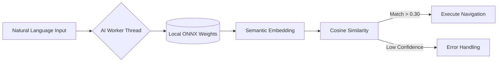
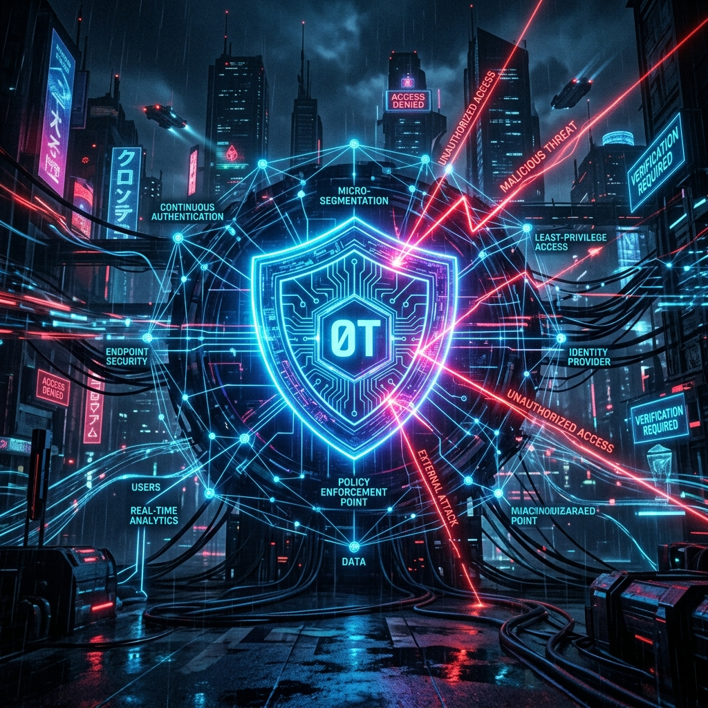

```text
      ___           ___           ___           ___           ___           ___           ___     
     /\  \         /\  \         /\  \         /\  \         /\  \         /\  \         /\  \    
    /::\  \        \:\  \       /::\  \       /::\  \       /::\  \       /::\  \       /::\  \   
   /:/\:\  \        \:\  \     /:/\:\  \     /:/\:\  \     /:/\:\  \     /:/\:\  \     /:/\:\  \  
  /::\~\:\  \       /::\  \   /::\~\:\  \   /:/  \:\  \   /:/  \:\  \   /:/  \:\  \   /:/  \:\__\ 
 /:/\:\ \:\__\     /:/\:\__\ /:/\:\ \:\__\ /:/__/ \:\__\ /:/__/ \:\__\ /:/__/ \:\__\ /:/__/ \/__/
 \/__\:\/:/  /    /:/  \/__/ \/__\:\/:/  / \:\  \  \/__/ \:\  \  \/__/ \:\  \  \/__/ \:\  \  
      \::/  /    /:/  /           \::/  /   \:\  \        \:\  \        \:\  \        \:\  \  
      /:/  /     \/__/            /:/  /     \:\  \        \:\  \        \:\  \        \:\  \ 
     /:/  /                      /:/  /       \:\__\        \:\__\        \:\__\        \:\__\
     \/__/                       \/__/         \/__/         \/__/         \/__/         \/__/ 
                                                                                
                    [SYSTEM_INIT] // NEURAL_INTENT_ENGINE // ZERO_TRUST_INFRA
```

# ⚡ ATROCITY.DEV

[](https://www.cloudflare.com/)
[](https://cloud.google.com/)
[](https://owasp.org/)

> **"Welcome to the system. Try not to break anything. Actually, do. That's why I built it."**

Atrocity.dev isn't your average "Hire Me" portfolio. It's a battle-hardened digital dossier designed with a red-team mindset. I'm a Cybersecurity student with a deep AI obsession, and this is where those two worlds collide in a high-performance, edge-accelerated explosion.

---

## 🛰 NEURAL INTENT ENGINE (V2)



Stop clicking buttons like a script-kiddie. My terminal features a **Self-Hosted Neural Processor** built with `Transformers.js`. 

- **Edge Intelligence:** Runs a quantized `all-MiniLM-L6-v2` model directly in your browser.
- **Web Worker Sandbox:** Off-thread inference ensures the UI stays at a silky 60fps while the weights are crunching.
- **Secure WASM:** Leveraging `wasm-unsafe-eval` for near-native performance while keeping the CSP tighter than a drum.
- **No-Leads Policy:** 100% client-side. No API keys, no tracking, no external CDN dependencies. Just raw neural power.



---

## 🛡 THE ZERO-TRUST ARCHITECTURE



Most sites are "Security through Obscurity." I prefer **Security through Paranoid Engineering.**

### 🌪 The Edge (Cloudflare)
The domain is fronted by **Cloudflare Edge**. We use it for more than just a proxy; it's our first line of defense.
- **Edge Firewall:** WAF rules that eat bots for breakfast.
- **SSL/TLS Hardening:** Zero-compromise encryption from the edge to the origin.

### 🚇 The Tunnel (IAP + WIF)
My production VM has **zero open ports** to the public internet. None. Nada. 
- **Identity-Aware Proxy (IAP):** Access is strictly tunneled. If you aren't authenticated through my GCP IAM, you don't even see a login prompt.
- **Workload Identity Federation (WIF):** My CI/CD pipeline is keyless. GitHub Actions "exchanges" a token with GCP to deploy. No long-lived service account keys = No keys for you to find in my logs.

---

## 🕹 TERMINAL COMMANDS // EASTER EGGS

You think you've seen the whole site? Type these in the terminal and see what happens.

| Command | Status | Description |
| :--- | :--- | :--- |
| `man hire` | `[READ_ONLY]` | Displays the Ashley Thomas Roy implementation manual. |
| `hack` | `[ACTIVE]` | Initiates a cryptographic firewall bypass challenge. |
| `breach` | `[CLASSIFIED]` | Unlocks the Dossier (Requires Level 5 Clearance). |
| `sudo rm -rf /` | `[DANGER]` | Watch the system melt. Don't say I didn't warn you. |
| `matrix` | `[OVERRIDE]` | Neural override of the site visuals. |

---

## 🛠 TECH MATRIX

| Layer | Technologies |
| :--- | :--- |
| **Frontend** | React 18, Vite, Framer Motion, TypeScript |
| **Edge AI** | Transformers.js v2, ONNX Runtime, Web Workers |
| **DevOps** | Docker (Alpine Node 25), GitHub Actions, WIF, IAP |
| **Network** | Cloudflare Edge, Nginx (Hardened CSP, Gzip/Brotli) |
| **Backend** | Express.js, MongoDB, Zod Validation, Regex-CORS |

---

<p align="center">
  
  <br>
  <b>Constructed by Ashley Thomas Roy</b><br>
  <i>Cybersecurity Student // AI Researcher</i><br>
  <code>// ATROCITY_INTEL_SYSTEMS //</code>
</p>
